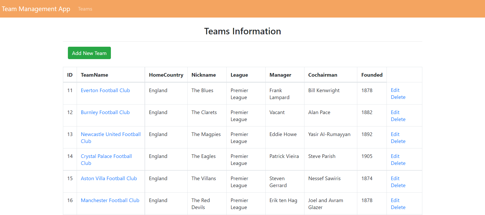
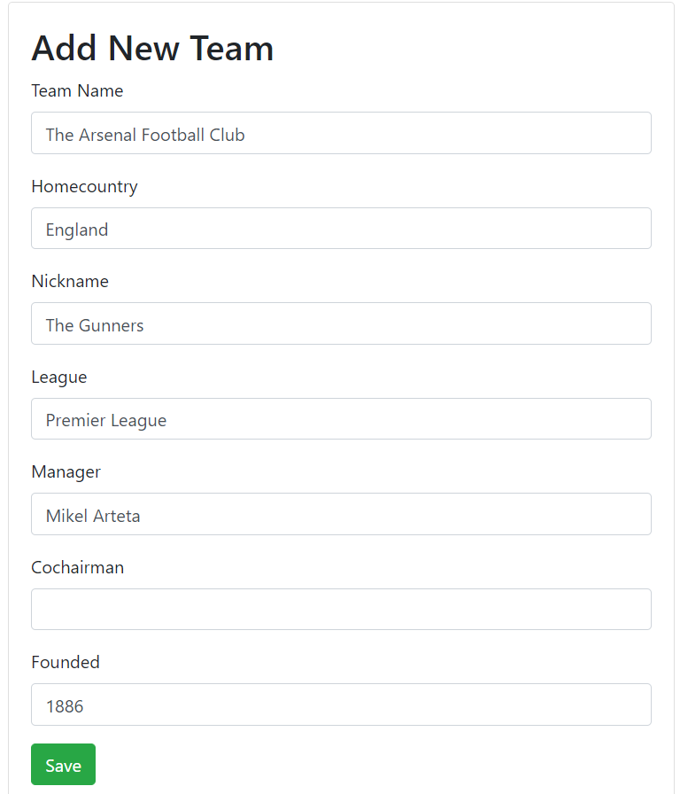
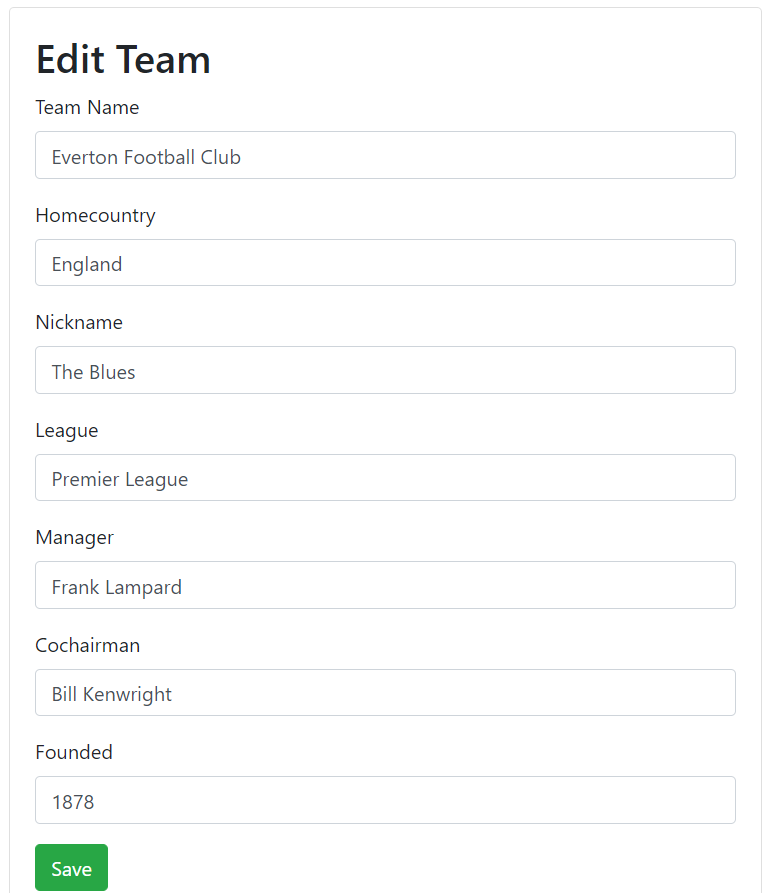
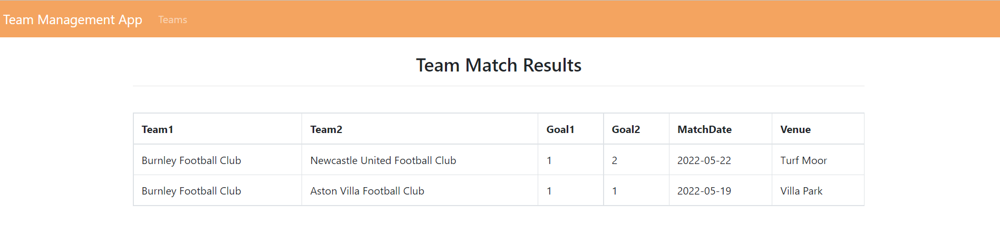

# Schedule And Results of Soccer Matches

This application provides information about soccer teams, results of the game with an opposite team displayed in the number of scored goals, and planned team matches with no results yet.

The web application allows:
1. create/read/update/delete information about team
2. display a list of all the teams and information about them
3. display matches results of a separate team

Entities:
* Teams
* Match
* Matchresults

Implementation details:
- Presentation layer: jsp(jstl if, forEach) and html files, servlets
- Business logic layer: EJB 3.1.0
- Data access layer: JPA

## Prerequisite installations

1. GlassFish 5.1.0 server
2. PostgreSQL 14
3. Java 8
4. Netbeans 12 or higher
5. PostgreSQL JDBC Driver 42.3.6 or higher

## Project setup

1. Create a local copy of the project with a command:
```
git@github.com:julse-lia/MatchSchedule.git
```
2. Open MatchScheduleProject folder in NetBeans IDE
3. Build and run project

## Program execution results
*index page*

<figcaption>Pic. 1.1 Index page image</figcaption>

*add new team form*

<figcaption>Pic. 1.2 Add team form</figcaption>

*edit team form*

<figcaption>Pic. 1.3 Edit team form</figcaption>

*team match results*

<figcaption>Pic. 1.4 Show match results</figcaption>

